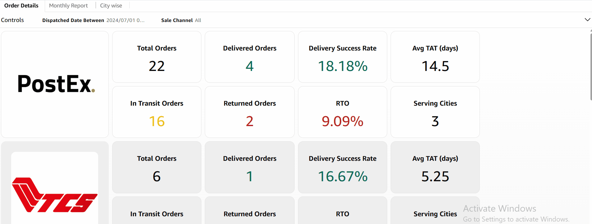
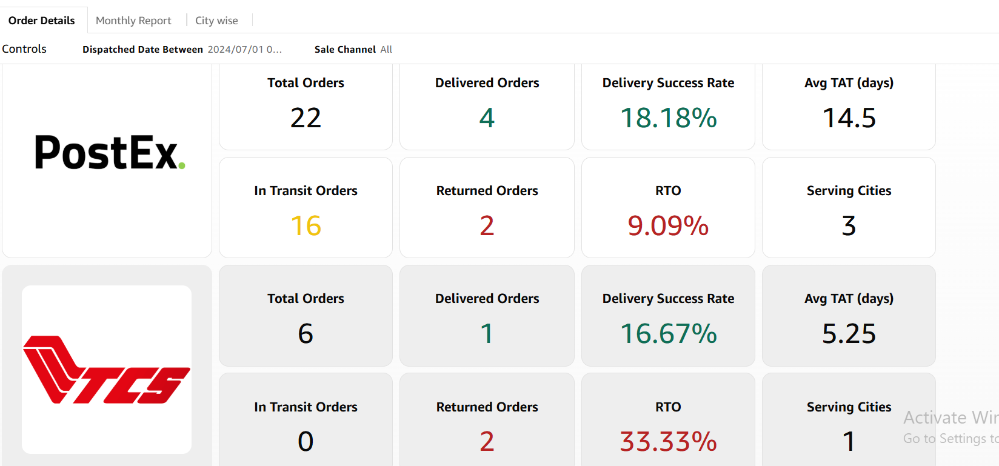
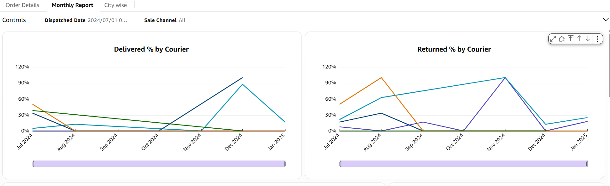
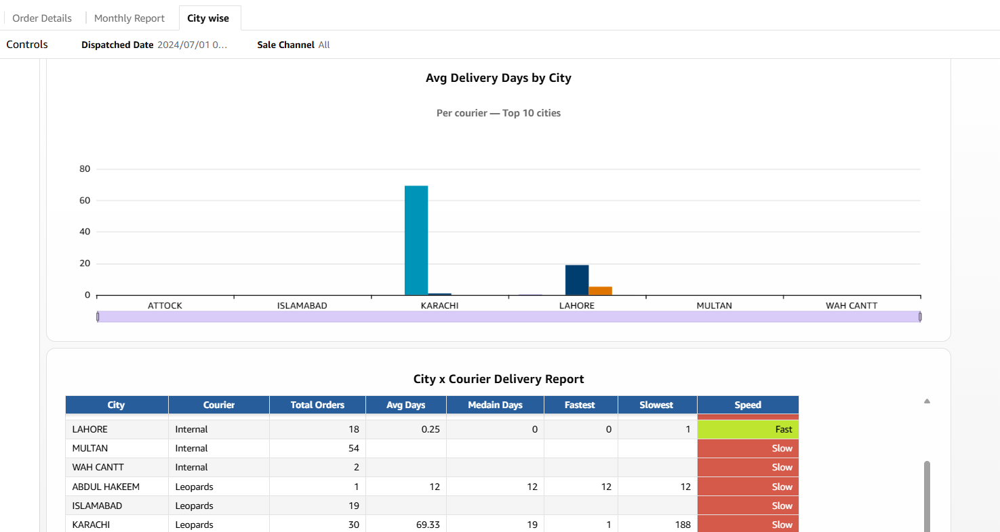

# Courier & Logistics Performance Dashboard (Amazon QuickSight)

> ⚠️ This dashboard was built using internal sample data, with values further randomized for public demonstration. As the dataset is anonymized and contains dummy values, some figures or trends may not reflect real-world scenarios.

## Overview

A multi-sheet operational dashboard built in **Amazon QuickSight** that evaluates courier performance across delivery success, return-to-origin (RTO) rate, and turnaround time (TAT) — broken down by courier, by month, and by city. It's designed to help logistics/ops teams decide which couriers to prioritize and where delivery performance needs attention.

## Business Questions

1. Which courier should get more order volume — the one handling the most orders, or the one with the best delivery success rate and lowest RTO?
2. Is delivery performance improving or degrading month over month, and does that trend justify renegotiating or dropping a courier contract?
3. Where does turnaround time actually break down — slow creation-to-dispatch handling internally, or slow dispatch-to-delivery from the courier — so the fix targets the right team?
4. Which cities are consistently slow across *every* courier (a regional logistics gap) versus slow with only *one* courier (a courier-specific problem)?
5. Are returns (RTO) concentrated in specific couriers, cities, or months — and is that pattern predictable enough to act on before it happens again?
6. Is order volume dangerously concentrated in one courier, creating risk if that courier underperforms or has capacity issues?
7. Which couriers have the strongest city coverage ("Serving Cities") relative to their performance — i.e., where can we expand delivery reach without sacrificing reliability?

## Tools & Data Source

- **Visualization:** Amazon QuickSight (3-sheet dashboard: Order Details, Monthly Report, City wise)
- **Data warehouse / source:** SQL — two joined queries feeding the dashboard:
  - [`sql/order_info_post_dispatch_query.sql`](sql/order_info_post_dispatch_query.sql) — order-level dispatch, delivery, and TAT data, with `CASE`-derived status buckets and dispatch/delivery turnaround categories
  - [`sql/courier_actual_status_query.sql`](sql/courier_actual_status_query.sql) — latest real-time courier status per order, pulled via a correlated subquery on the most recent status timestamp

## Data Model

Both queries key off `childOrder_no` (order identifier) and are joined in QuickSight to combine dispatch-level order data with the courier's most recent live status. TAT metrics (dispatch-to-delivery, creation-to-dispatch) are pre-calculated in SQL using `DATEDIFF`, bucketed into day ranges (e.g. "0–1 Day", "2–3 Days") so QuickSight can aggregate them directly without recomputing date math in-dashboard.

## Dashboard Preview

### Sheet 1 — Order Details

Per-courier KPI cards (one row per courier — PostEx, TCS, TRAX, Leopards, etc.):

| Metric | What it measures |
|---|---|
| Total Orders | Volume handled by this courier |
| Delivered Orders / Delivery Success Rate | Completed deliveries and % success |
| In Transit Orders | Orders currently moving |
| Returned Orders / RTO | Orders sent back, and return rate |
| Avg TAT (days) | Average turnaround time |
| Serving Cities | Geographic coverage |

### Sheet 2 — Monthly Report

- **Delivered % / Returned % by Courier** — monthly trend lines per courier
- **Order Dispatched per Courier** — stacked bar showing volume mix by month
- **Overall Split** — pie chart of total order share by courier
- **Delivery Days by Courier** — distribution across day-range buckets
- **Avg Delivery Days – Monthly** — trend of average delivery time per courier
- **Monthly Courier Report table** — full breakdown by month × courier: Total/Delivered/Returned Orders, Delivered %, Returned %, Avg Dispatch Days, Avg Delivery Days — with conditional color formatting (red/yellow/green) for fast at-a-glance scanning

### Sheet 3 — City wise

- **Avg Delivery Days by City** — top 10 cities by delivery speed
- **City × Courier Delivery Report** — Avg/Median/Fastest/Slowest delivery days per city-courier pair, with a "Speed" rating (Fast/Slow) flag

## Skills Demonstrated

- SQL: multi-table joins, correlated subquery for "latest status per order," `DATEDIFF`-based TAT calculation, `CASE`-based status bucketing
- QuickSight: multi-sheet dashboard design, KPI card grids, monthly trend combo charts, conditional formatting tables, geographic/top-N breakdowns, cross-sheet filter controls (date range, sale channel, locality)
- Data anonymization: pseudonymizing identifiers while preserving TAT calculation accuracy (date-shift technique that preserves relative day differences)

## Challenges & Learnings

- Reconciling two data sources (dispatch info + live courier status) that update on different cadences
- Choosing day-range buckets that are meaningful for ops decisions rather than just raw averages, which can be skewed by outliers
